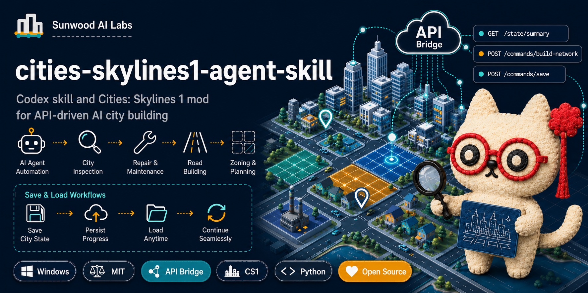
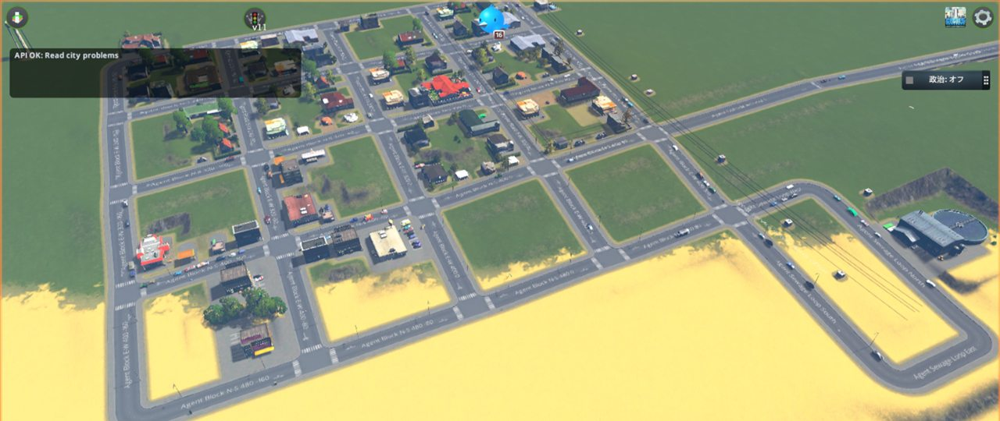
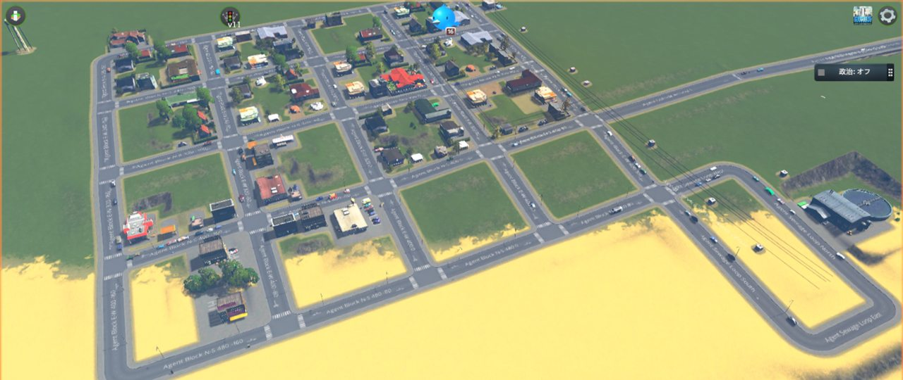

<p align="center">
  
</p>

<h1 align="center">cities-skylines1-agent-skill</h1>

<p align="center">
  Codex skill and Cities: Skylines 1 mod for API-driven city inspection, repair, building, zoning, and saving.
</p>

<p align="center">
  <a href="README.ja.md">日本語 README</a> ·
  <a href="https://sunwood-ai-labs.github.io/cities-skylines1-agent-skill/">Docs</a> ·
  <a href="docs/api.md">API Reference</a> ·
  <a href="CONTRIBUTING.md">Contributing</a>
</p>

<p align="center">
  <a href="https://github.com/Sunwood-ai-labs/cities-skylines1-agent-skill/actions/workflows/docs.yml"></a>
  <a href="https://github.com/Sunwood-ai-labs/cities-skylines1-agent-skill/actions/workflows/pages.yml"></a>
  <a href="LICENSE"></a>
  
  
</p>

The goal is simple: stop relying on screenshots for city state. The bridge exposes useful Cities: Skylines 1 data as local API responses, then lets agents make small explicit changes such as deleting a segment, building a road, placing a service, painting a zone, changing simulation speed, and saving the city.



## ✨ What It Does

- Runs a CS1 mod that listens on `http://127.0.0.1:32123`.
- Exposes city state APIs for problems, facilities, networks, road anomalies, building placement anomalies, zoning anomalies, saves, and prefabs.
- Exposes focused command APIs for network creation, zoning, building placement, building movement, bulldozing, simulation speed, batch helpers, and saving.
- Shows in-game API activity in a persistent console with timestamps, clear, and minimize controls.
- Includes Windows scripts for building the mod, launching Resume, starting a fresh map, inspecting issues, repairing bounded anomalies, and saving.
- Ships as a Codex skill through [SKILL.md](SKILL.md) and [agents/openai.yaml](agents/openai.yaml).

## 🖼️ Screenshot Tour

### In-Game API Console

Every game-state API request is appended to a compact CS1 UI console, so recent agent activity stays visible while you work.


### Agent-Built Starter City

The bridge can resume a save, inspect city data, repair infrastructure, and keep developing the city without starting over.



### Road Repair Workflow

Road issues are detected from CS1 network data, not image recognition. The agent can then call separate APIs to bulldoze bad segments and rebuild clean connections.

## 🚀 Quick Start

Edit `scripts/build.ps1` if your CS1 install path differs, then build and install the mod:

```powershell
powershell -NoProfile -ExecutionPolicy Bypass -File .\scripts\build.ps1
```

The script compiles `SkylinesAgentBridge.dll` and copies it into:

```text
%LOCALAPPDATA%\Colossal Order\Cities_Skylines\Addons\Mods\SkylinesAgentBridge
```

Enable the mod in the CS1 content manager, load a city, then test:

```powershell
Invoke-RestMethod http://127.0.0.1:32123/health
Invoke-RestMethod http://127.0.0.1:32123/state/summary
```

Development uses a lightweight Git Flow model: feature branches target `develop`, while releases and hotfixes target `main`. See [CONTRIBUTING.md](CONTRIBUTING.md) for the branch and AI review workflow.

For the normal agent loop, resume the newest local save:

```powershell
powershell -NoProfile -ExecutionPolicy Bypass -File .\scripts\start-resume.ps1
```

For clean experiments, start a fresh map:

```powershell
powershell -NoProfile -ExecutionPolicy Bypass -File .\scripts\start-new-map.ps1
```

## 🧭 Agent Repair Pattern

Keep the workflow generic. Prefer separate commands over a magical repair endpoint:

1. Inspect with `/state/problems`, `/state/road-anomalies`, `/state/building-anomalies`, `/state/facilities`, and `/state/networks`.
2. Remove bad objects with `/commands/bulldoze`.
3. Rebuild with `/commands/build-network`, `/commands/place-building`, `/commands/move-building`, and `/commands/set-zone`.
4. Let the simulation settle with `/commands/set-simulation-speed`.
5. Re-check state APIs.
6. Save with `/commands/save` or `scripts/save-city.ps1`, then verify with `/state/saves`.

## 🔌 API Surface

Read APIs:

- `GET /health`
- `GET /state/summary`
- `GET /state/problems`
- `GET /state/chirps`
- `GET /state/zones`
- `GET /state/economy`
- `GET /state/facilities`
- `GET /state/networks`
- `GET /state/road-anomalies`
- `GET /state/building-anomalies`
- `GET /state/zone-anomalies`
- `GET /state/saves`
- `GET /state/captures`
- `GET /prefabs/roads`
- `GET /prefabs/networks`
- `GET /prefabs/buildings`

Command APIs:

- `POST /commands/build-network`
- `POST /commands/build-road` compatibility alias
- `POST /commands/set-zone`
- `POST /commands/place-building`
- `POST /commands/move-building`
- `POST /commands/bulldoze`
- `POST /commands/save`
- `POST /commands/capture-view`
- `POST /commands/restore-ui`
- `POST /commands/set-simulation-speed`
- `POST /commands/set-tax-rate`
- `POST /commands/batch` optional convenience wrapper

See [docs/api.md](docs/api.md) for request examples and response shapes.

## 🧩 Skill Usage

This repository is also a Codex skill. The root [SKILL.md](SKILL.md) tells an agent how to operate CS1 through this bridge.

Example prompt:

```text
Use $cities-skylines1-agent-skill to resume my CS1 city, inspect current problems, repair road/infrastructure issues with separate API calls, save the city, and report what changed.
```

## 📚 Documentation

- [Docs site](https://sunwood-ai-labs.github.io/cities-skylines1-agent-skill/)
- [Getting Started](docs/guide/getting-started.md)
- [Agent Workflow](docs/guide/usage.md)
- [Architecture](docs/guide/architecture.md)
- [Troubleshooting](docs/guide/troubleshooting.md)
- [API Reference](docs/api.md)
- [Japanese experiment article](docs/articles/building-cities-skylines-with-ai-agents-ja.md)

## 🗂️ Repository Layout

```text
.
├── SKILL.md                 # Codex skill instructions
├── agents/openai.yaml       # Skill UI metadata
├── src/                     # CS1 mod source
├── scripts/                 # Build, launch, inspect, repair, save, and QA scripts
├── docs/                    # VitePress docs and API reference
└── .github/workflows/       # Docs validation and Pages deployment
```

## ⚠️ Status

This is experimental and built for CS1 on Windows. Test on throwaway saves first. The bridge mutates live CS1 simulation objects through game-thread queued commands, so keep changes small and verify after each step.

## 📄 License

MIT. See [LICENSE](LICENSE).
